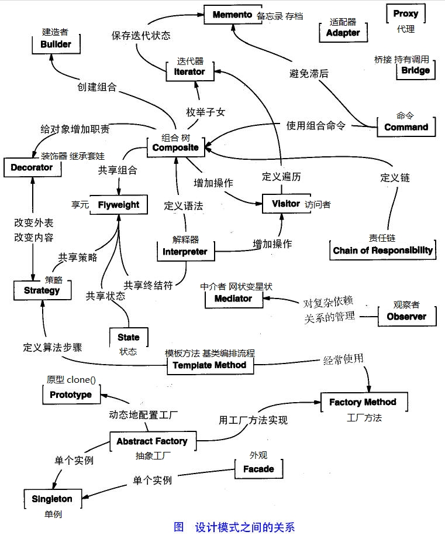

# Design Pattern
https://refactoringguru.cn/design-patterns/python
https://www.runoob.com/design-pattern/singleton-pattern.html
-----------------
## 设计模式简介
### 设计模式
设计模式是软件开发人员在软件开发过程中面临的一般问题的解决方案。由众多软件开发人员经过相当长的时间总结出来。   
设计模式是一套被反复使用的、多数人知晓的、经过分类编目的、代码设计经验的总结。使用设计模式是为了 **重用代码、让代码更容易被他人理解、保证代码可靠性**。设计模式使代码编制真正工程化，设计模式是软件工程的基石，如同大厦的一块块砖石一样。项目中合理地运用设计模式可以完美地解决很多问题，每种模式在现实中都有相应的原理来与之对应，每种模式都描述了一个在我们周围不断重复发生的问题，以及该问题的核心解决方案，这也是设计模式能被广泛应用的原因。
### 设计模式的面向对象原则
* 对接口编程而不是对实现编程。
* 优先使用对象组合而不是继承。
### 设计模式的类型
大致总共有 23 种设计模式。这些模式可以分为三大类：创建型模式（Creational Patterns）、结构型模式（Structural Patterns）、行为型模式（Behavioral Patterns）。当然，我们还会讨论另一类设计模式：J2EE 设计模式。

|序号|模式&描述|包括|
|---|---|---|
|1|创建型模式 <br>这些设计模式提供了一种在创建对象的同时隐藏创建逻辑的方式，而不是使用 new 运算符直接实例化对象。这使得程序在判断针对某个给定实例需要创建哪些对象时更加灵活。|<li>工厂模式（Factory Pattern）<li>抽象工厂模式（Abstract Factory Pattern） <li>单例模式（Singleton Pattern） <li>建造者模式（Builder Pattern） <li>原型模式（Prototype Pattern）| 
|2|	结构型模式<br>这些模式关注对象之间的组合和关系，旨在解决如何构建灵活且可复用的类和对象结构。|<li>适配器模式（Adapter Pattern）<li> 桥接模式（Bridge Pattern）<li>过滤器模式（Filter、Criteria Pattern）<li>组合模式（Composite Pattern）<li>装饰器模式（Decorator Pattern）<li>外观模式（Facade Pattern）<li>享元模式（Flyweight Pattern）<li>代理模式（Proxy Pattern）|
|3|行为型模式<br>这些模式关注对象之间的通信和交互，旨在解决对象之间的责任分配和算法的封装。|<li>责任链模式（Chain of Responsibility Pattern）<li>命令模式（Command Pattern）<li>解释器模式（Interpreter Pattern）<li>迭代器模式（Iterator Pattern）<li>中介者模式（Mediator Pattern）<li>备忘录模式（Memento Pattern）<li>观察者模式（Observer Pattern）<li>状态模式（State Pattern）<li>空对象模式（Null Object Pattern）<li>策略模式（Strategy Pattern）<li>模板模式（Template Pattern）<li>访问者模式（Visitor Pattern）|
|4|J2EE 模式<br>这些设计模式特别关注表示层。这些模式是由 Sun Java Center 鉴定的。|<li>MVC 模式（MVC Pattern）<li>业务代表模式（Business Delegate Pattern）<li>组合实体模式（Composite Entity Pattern）<li>数据访问对象模式（Data Access Object Pattern）<li>前端控制器模式（Front Controller Pattern）<li>拦截过滤器模式（Intercepting Filter Pattern）<li>服务定位器模式（Service Locator Pattern）<li>传输对象模式（Transfer Object Pattern）|


### 设计模式六大原则
1. 开闭原则（Open Close Principle）

开闭原则的意思是：**对扩展开放，对修改关闭**。在程序需要进行拓展的时候，不能去修改原有的代码，实现一个热插拔的效果。简言之，是为了使程序的扩展性好，易于维护和升级。想要达到这样的效果，我们需要使用**接口和抽象类**，后面的具体设计中我们会提到这点。

2. 里氏代换原则（Liskov Substitution Principle）

里氏代换原则是面向对象设计的基本原则之一。 里氏代换原则中说，**任何基类可以出现的地方，子类一定可以出现**。LSP 是继承复用的基石，只有当派生类可以替换掉基类，且软件单位的功能不受到影响时，基类才能真正被复用，而派生类也能够在基类的基础上增加新的行为。里氏代换原则是对开闭原则的补充。实现开闭原则的关键步骤就是抽象化，而基类与子类的继承关系就是抽象化的具体实现，所以里氏代换原则是对实现抽象化的具体步骤的规范。
在 Python 中，这些基类、接口、派生类等概念通常通过类来实现。
```Python
# 接口通过ABC实现
from abc import ABC, abstractmethod

class Speaker(ABC):
    @abstractmethod
    def speak(self):
        pass

class Human(Speaker):
    def speak(self):
        return "Hello!"
# 多态性
def animal_sound(animal):
    print(animal.speak())

animal_sound(Dog("Buddy"))
animal_sound(Cat("Whiskers"))


```

3. 依赖倒转原则（Dependence Inversion Principle）

这个原则是开闭原则的基础，具体内容：**针对接口编程，依赖于抽象而不依赖于具体**。

4. 接口隔离原则（Interface Segregation Principle）

这个原则的意思是：使用多个隔离的接口，比使用单个接口要好。它还有另外一个意思是：降低类之间的耦合度。由此可见，其实设计模式就是从大型软件架构出发、便于升级和维护的软件设计思想，它强调降低依赖，降低耦合。

5. 迪米特法则，又称最少知道原则（Demeter Principle）

最少知道原则是指：一个实体应当尽量少地与其他实体之间发生相互作用，使得系统功能模块相对独立。

7. 合成复用原则（Composite Reuse Principle）

合成复用原则是指：尽量使用合成/聚合的方式，而不是使用继承。

-----------------
## 设计模式
--------------
### 工厂模式
1. 介绍  
工厂模式设计模式属于创建型模式，它提供了一种创建对象的最佳方式。工厂模式属于创建型模式，它在创建对象时提供了一种封装机制，将实际创建对象的代码与使用代码分离。
**何时使用**：我们明确地计划不同条件下创建不同实例时。  
**如何解决**：让其子类实现工厂接口，返回的也是一个抽象的产品。    
**优点**： 1、一个调用者想创建一个对象，只要知道其名称就可以了。 2、扩展性高，如果想增加一个产品，只要扩展一个工厂类就可以。 3、屏蔽产品的具体实现，调用者只关心产品的接口。  
2. 代码
    ```Python
    from abc import ABC, abstractmethod
    class Transport(ABC):
        """交通工具的基类（接口）"""
        @abstractmethod 
        def deliver(self):
            pass

    class Truck(Transport):
        """卡车类，一种具体的交通工具"""
        def deliver(self):
            return "Deliver by land in a box."

    class Ship(Transport):
        """船类，另一种具体的交通工具"""
        def deliver(self):
            return "Deliver by sea in a container."

    class TransportFactory:
        """运输工具工厂类"""
        def get_transport(self, transport_type):
            """根据传入的类型返回具体的运输工具实例"""
            if transport_type == 'truck':
                return Truck()
            elif transport_type == 'ship':
                return Ship()
            else:
                raise ValueError('Transport type not supported.')

    # 使用工厂模式创建对象
    factory = TransportFactory()
    truck = factory.get_transport('truck')
    print(truck.deliver())  # 输出: Deliver by land in a box.

    ship = factory.get_transport('ship')
    print(ship.deliver())  # 输出: Deliver by sea in a container.

    ```
### 单例模式
1. 介绍   
单例模式是一种创建型设计模式， 让你能够保证一个类只有一个实例， 并提供一个访问该实例的全局节点。  
2. 适合应用场景  
**如果程序中的某个类对于所有客户端只有一个可用的实例， 可以使用单例模式**
单例模式禁止通过除特殊构建方法以外的任何方式来创建自身类的对象。 该方法可以创建一个新对象， 但如果该对象已经被创建， 则返回已有的象。
**如果你需要更加严格地控制全局变量， 可以使用单例模式**
# UML(Unified Modeling Language)


